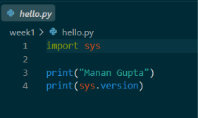
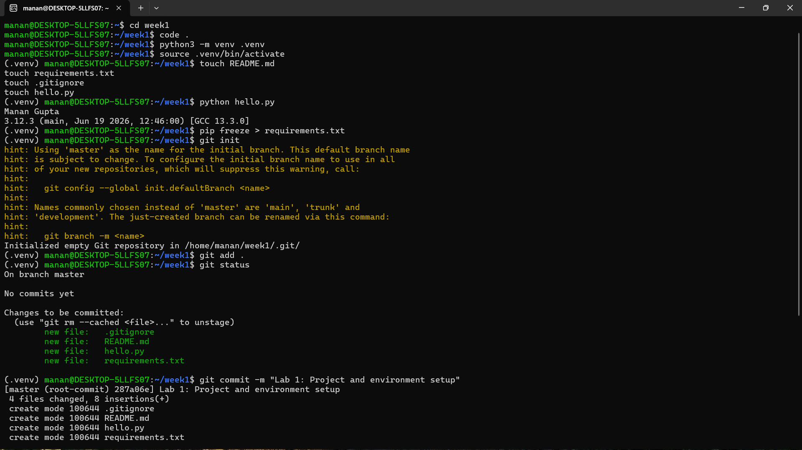
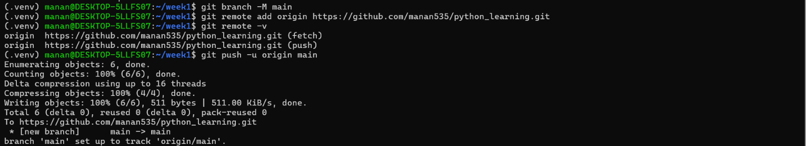

# Week 1 - Python Foundations

This folder contains the Week 1 assignments completed as part of my Python internship/training.

## Lab 1 - Project and Environment Setup

### Objective

Create a clean, reproducible Python project using a virtual environment on Linux (WSL).

### Project Structure

```
week1/Lab1/
├── .venv/
├── screenshots/
│   ├── code.png
│   ├── ubuntu_1.png
│   └── ubuntu_2.png
├── .gitignore
├── hello.py
├── README.md
└── requirements.txt
```

## Tasks Completed

- Created a Python project.
- Created and activated a virtual environment using `venv`.
- Added a `.gitignore` file.
- Created `hello.py` to print my name and the current Python version.
- Generated `requirements.txt` using `pip freeze`.
- Completed the project using Ubuntu on Windows Subsystem for Linux (WSL).

## Running the Project

Activate the virtual environment:

```bash
source .venv/bin/activate
```

Run the program:

```bash
python hello.py
```

## Output

Example output:

```
Manan Gupta
3.12.x (...)
```

## Screenshots

### VS Code Project



### Ubuntu Terminal - Creating and Activating Virtual Environment



### Ubuntu Terminal - Running the Program



## Technologies Used

- Python
- Ubuntu (WSL)
- Virtual Environments (`venv`)
- Git
- Visual Studio Code