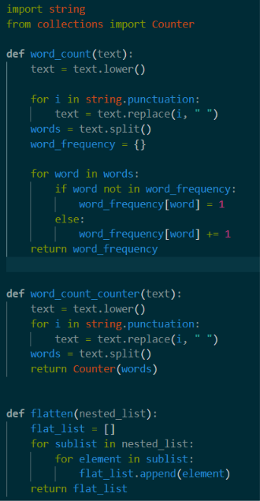
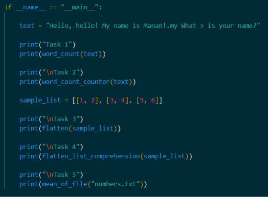
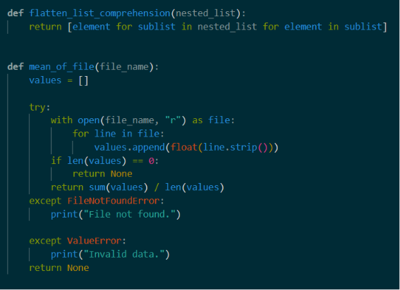
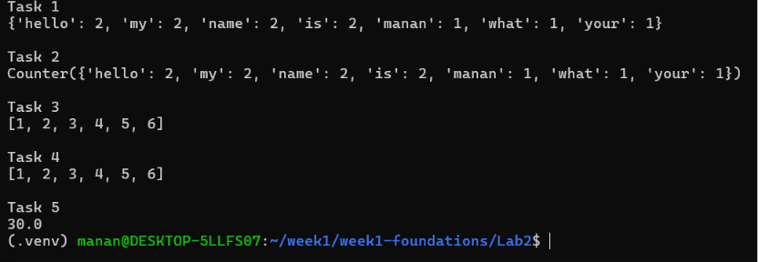
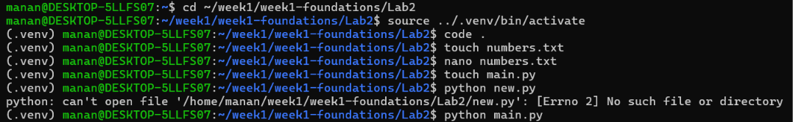

# Lab 2 - Python Fluency Drills

## Objective

This lab focuses on improving Python programming skills by writing clean, readable functions and implementing proper error handling. The tasks cover dictionaries, Python's standard library, list comprehensions, file handling, and exception handling.

---

## Files

```
Lab2/
├── fluency.py
├── numbers.txt
├── README.md
└── screenshots/
    ├── Code_1.png
    ├── Code_2.png
    ├── Code_3.png
    ├── output.png
    └── ubuntu.png
```

---

## Task 1 – Word Count Using Dictionary

Implemented `word_count(text)` to count the frequency of each word in a given string.

### Features
- Converts text to lowercase.
- Removes punctuation.
- Splits the text into individual words.
- Stores the frequency of each word in a dictionary.

---

## Task 2 – Word Count Using `collections.Counter`

Reimplemented the word counting functionality using Python's built-in `Counter` class.

### Features
- Produces the same result as Task 1.
- Uses Python's standard library for a simpler implementation.
- Confirms that both implementations return identical word counts.

---

## Task 3 – Flatten a Nested List Using Loops

Implemented `flatten()` using nested loops.

### Features
- Traverses each sublist.
- Appends every element into a single list.
- Returns the flattened list.

Example:

```
Input:
[[1, 2], [3, 4], [5, 6]]

Output:
[1, 2, 3, 4, 5, 6]
```

---

## Task 4 – Flatten a Nested List Using List Comprehension

Implemented the same functionality using a list comprehension.

### Features
- Produces the same output as Task 3.
- Demonstrates Python's concise syntax.

---

## Task 5 – Calculate Mean of Numbers from a File

Implemented `mean_of_file(path)`.

### Features
- Reads numbers from a text file.
- Converts each line into a floating-point number.
- Calculates and returns the arithmetic mean.
- Handles missing files and invalid data using `try` and `except`.

---

## Task 6 – Demonstration Block

Used

```python
if __name__ == "__main__":
```

to demonstrate every function with sample inputs and display their outputs.

---

## Sample Output

```
Task 1
{'hello': 2, 'my': 2, 'name': 2, 'is': 2, 'manan': 1, 'what': 1, 'your': 1}

Task 2
Counter({'hello': 2, 'my': 2, 'name': 2, 'is': 2, 'manan': 1, 'what': 1, 'your': 1})

Task 3
[1, 2, 3, 4, 5, 6]

Task 4
[1, 2, 3, 4, 5, 6]

Task 5
30.0
```

---

## Screenshots

### Code - Part 1



---

### Code - Part 2



---

### Code - Part 3



---

### Program Output



---

### Ubuntu (WSL) Execution



---

## Technologies Used

- Python 3
- Ubuntu (WSL)
- Visual Studio Code
- Python Virtual Environment (`venv`)
- Git & GitHub
