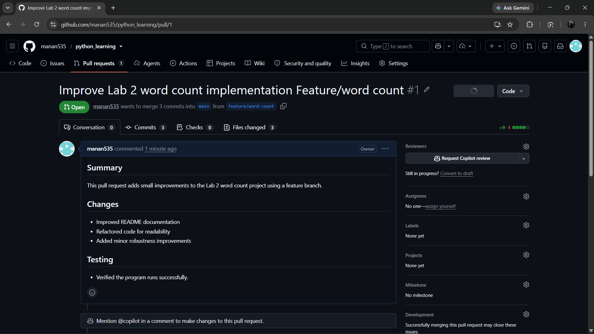
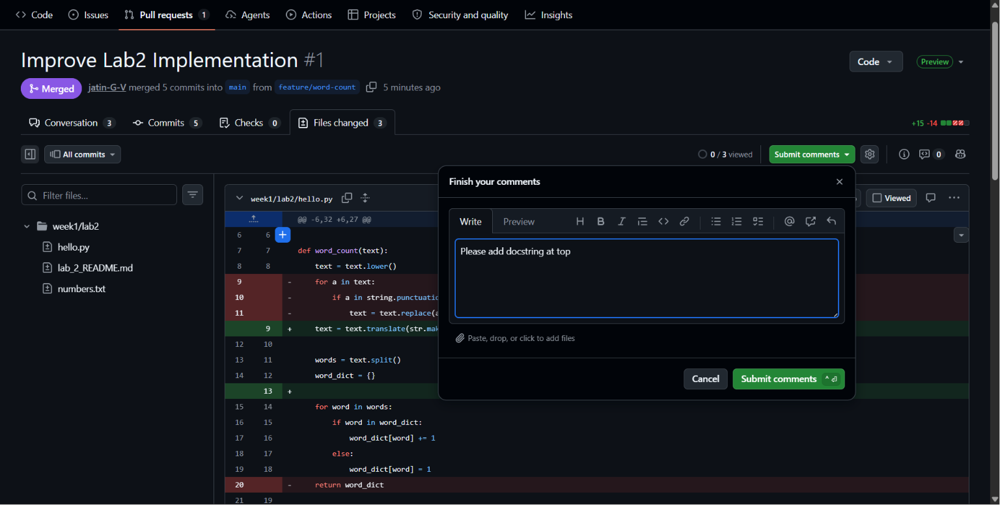
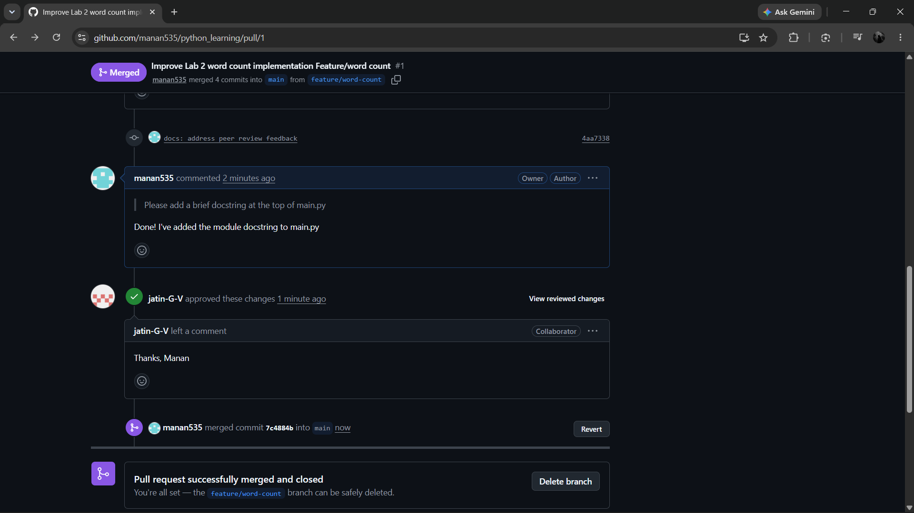
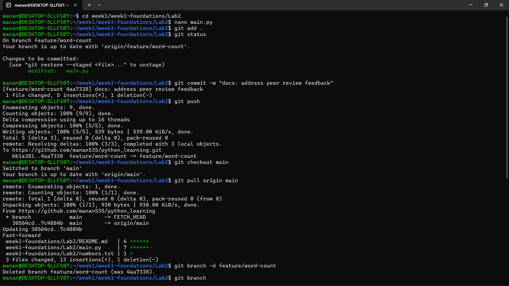

# Lab 3 – Git and GitHub Workflow

## Objective
Practice a real Git workflow using feature branches, pull requests, peer reviews, and merging.

---

## 1. Create Feature Branch

Created a new feature branch for implementing improvements.

```bash
git checkout -b feature/word-count
```

---

## 2. Make Small Commits

Implemented the required changes in multiple commits using meaningful commit messages.

---

## 3. Push the Branch

```bash
git push -u origin feature/word-count
```

---

## 4. Create Pull Request

Created a Pull Request from `feature/word-count` to `main`.



---

## 5. Peer Review

A peer reviewed the code and requested a module docstring in `main.py`.

### Review Comment



---

## 6. Address Review Feedback

Added the requested module docstring, committed the changes, and pushed the updated branch.

```bash
git add .
git commit -m "docs: address peer review feedback"
git push
```

---

## 7. Review Approved and Pull Request Merged

The reviewer approved the changes, and the Pull Request was merged into the `main` branch.



---

## 8. Local Repository Cleanup

After merging, switched back to `main`, pulled the latest changes, and deleted the feature branch.

```bash
git checkout main
git pull origin main
git branch -d feature/word-count
```

Terminal output:



---

## Outcome

- ✅ Feature branch created
- ✅ Multiple commits made
- ✅ Pull Request created
- ✅ Peer review completed
- ✅ Review feedback addressed
- ✅ Pull Request approved
- ✅ Changes merged into `main`
- ✅ Feature branch deleted