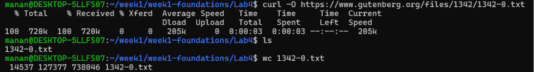
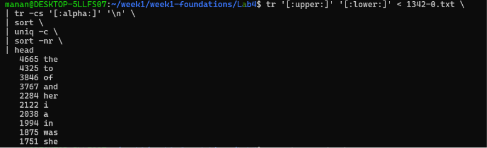
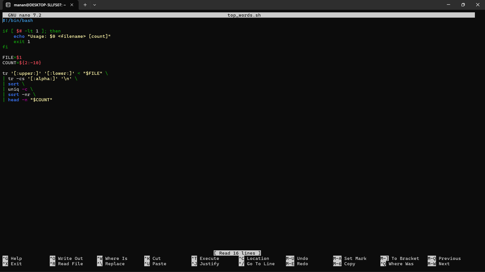
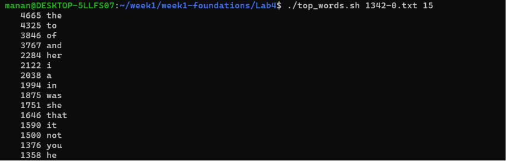

# Lab 4 – Command Line and Bash

## Objective

The goal of this lab was to become comfortable with the Linux command line and create a parameterized Bash script for finding the most frequent words in a text file.

---

## 1. Download a Text File

A plain-text book was downloaded from Project Gutenberg using `curl`.

```bash
curl -O https://www.gutenberg.org/files/1342/1342-0.txt
```

The downloaded file was `1342-0.txt`.



---

## 2. Find the 10 Most Frequent Words

The following shell pipeline was used to find the most frequent words:

```bash
tr '[:upper:]' '[:lower:]' < 1342-0.txt \
| tr -cs '[:alpha:]' '\n' \
| sort \
| uniq -c \
| sort -nr \
| head
```

### What the commands do

- `tr '[:upper:]' '[:lower:]'` – converts uppercase letters to lowercase.
- `tr -cs '[:alpha:]' '\n'` – separates words and removes non-alphabetic characters.
- `sort` – sorts the words alphabetically.
- `uniq -c` – counts occurrences of each word.
- `sort -nr` – sorts the counts from highest to lowest.
- `head` – displays the top 10 results.



---

## 3. Count Lines, Words, and Characters

The `wc` command was used to count the contents of the text file.

```bash
wc 1342-0.txt
```

The output provides:

- Number of lines
- Number of words
- Number of characters
- Filename

---

## 4. Create the Bash Script

A parameterized script named `top_words.sh` was created.

```bash
nano top_words.sh
```

The script accepts:

```text
./top_words.sh <filename> [count]
```

The count is optional and defaults to `10`.

### Example

```bash
./top_words.sh 1342-0.txt
```

This prints the 10 most frequent words.

```bash
./top_words.sh 1342-0.txt 15
```

This prints the 15 most frequent words.

---

## 5. Make the Script Executable

The script was made executable using:

```bash
chmod +x top_words.sh
```

It was then executed directly:

```bash
./top_words.sh 1342-0.txt
```



---

## 6. Test with a Custom Count

The script also supports a custom number of results.

```bash
./top_words.sh 1342-0.txt 15
```



---

## 7. Script

```bash
#!/bin/bash

if [ $# -lt 1 ]; then
    echo "Usage: $0 <filename> [count]"
    exit 1
fi

FILE=$1
COUNT=${2:-10}

tr '[:upper:]' '[:lower:]' < "$FILE" \
| tr -cs '[:alpha:]' '\n' \
| sort \
| uniq -c \
| sort -nr \
| head -n "$COUNT"
```

---

## Outcome

- ✅ Downloaded a plain-text file using `curl`
- ✅ Used shell pipelines to find frequent words
- ✅ Used `wc` to count lines, words, and characters
- ✅ Created a parameterized Bash script
- ✅ Added a default count of 10
- ✅ Made the script executable with `chmod +x`
- ✅ Tested the script with different input counts
- ✅ Ran the script on text files successfully